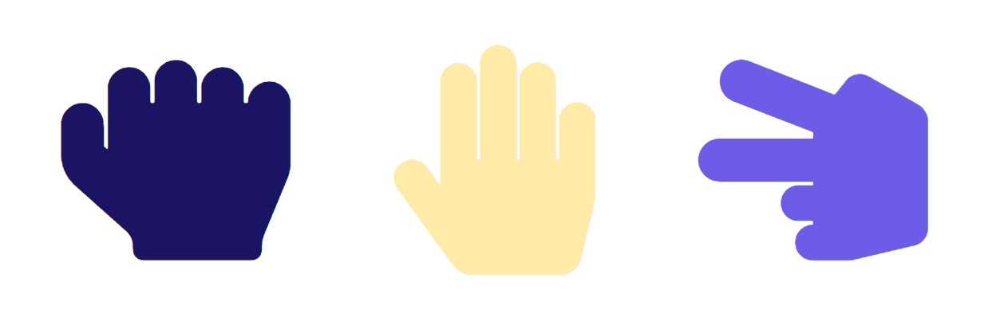

<p align="center">
<a href="https://grzegorz-jodlowski.github.io/rock-paper-scissors-game/"></a>
</p>


# <p align="center">✂ Rock-paper–scissors game</p>
<p align="center">Project for learning basic JavaScript and algorithms</p>

</br>

## Table of Contents

- [What's this project about?](#about)
- [Technologies used](#technologies)
- [What I learned?](#what)
- [Interesting code snippet](#interesting)
- [GitHub Pages](#gitHub)

</br>

## <a name="about"></a>What's this project about?

Simple, old-school rock-paper-scissors game written in pure JS (Vanilla JS). The opponent in the game is a computer that randomly chooses its move.

</br>

## <a name="technologies"></a>Technologies used
- HTML
- CSS
- SCSS
- JavaScript
- npm
- GIT

</br>

## <a name="what"></a>What I learned?
- w


</br>

## <a name="interesting"></a>Interesting code snippet (for me of course 😉)
- c

```css

}
```

</br>

## <a name="gitHub"></a>GitHub Pages
<a href="https://grzegorz-jodlowski.github.io/rock-paper-scissors-game/">Rock-paper–scissors game</a>


